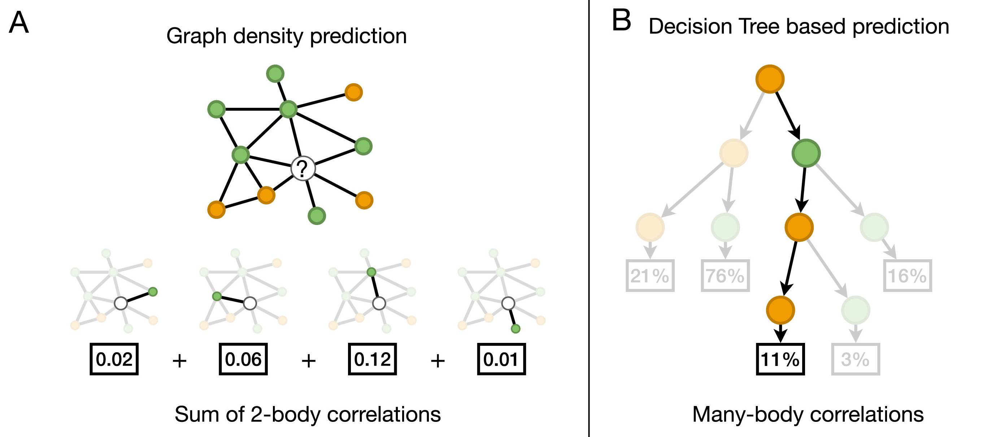
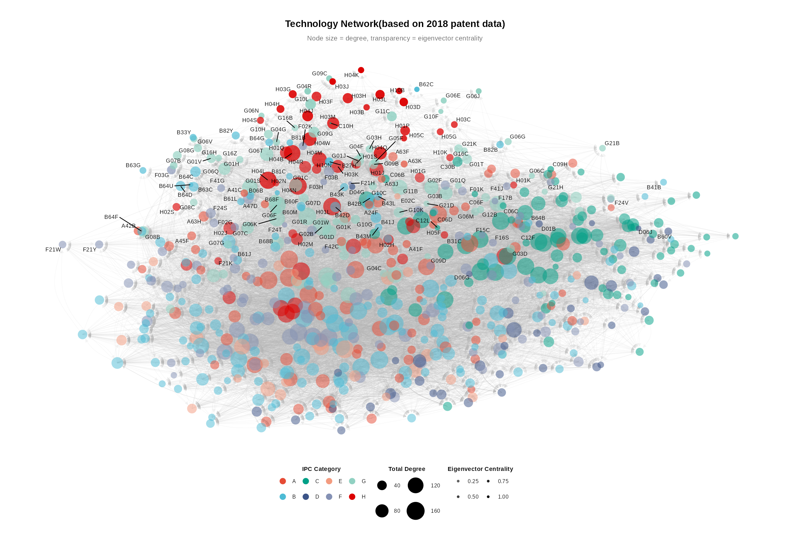
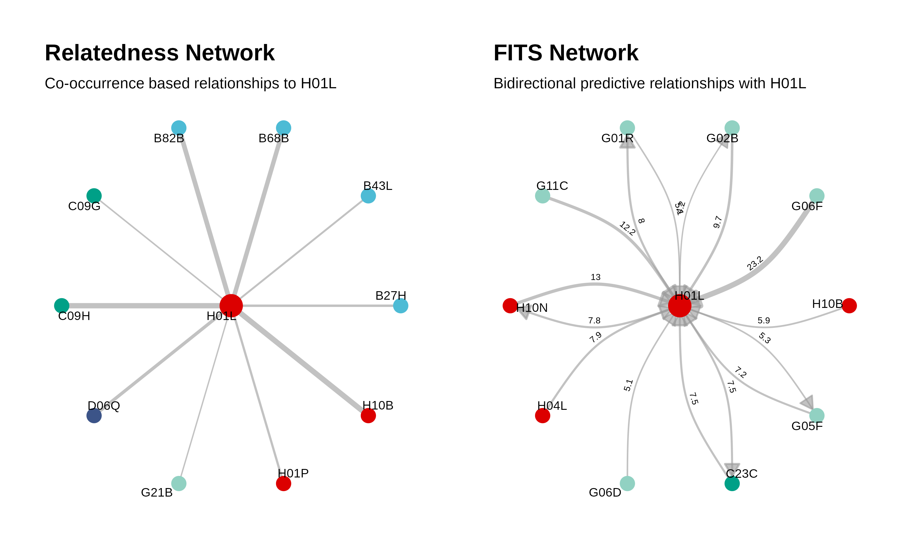
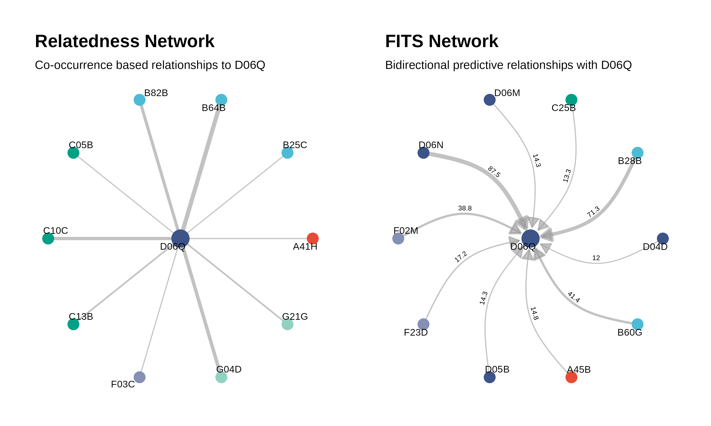

# The interconnectedness between regions and technologies

## Methodological Motivation

Traditional relatedness frameworks model diversification through symmetric co-occurrence matrices and linear aggregation of relatedness density [@hausmann2011network]. However, as established in our problem statement, these constructs suffer from three structural limitations: (1) symmetry assumptions that obscure directional dependencies between technologies, (2) linear aggregation that loses granular information about technology-specific requirements, and (3) noise when technologies outnumber regions.

We address these limitations by replacing traditional measures with a machine learning training strategy based on the Random Forest algorithm (RF). Specifically, we use RF to generate: (1) **Feature Importance Technology Space (FITS)** following @fessina2024identifying, analogous to the mainstream Technology Space. FITS captures directional, hierarchical technology relationships, replacing symmetric relatedness measures; and (2) **predicted probabilities (technological potential)** following @albora2023product, analogous to relatedness density. The technological potential estimates region-specific feasibility of technology adoption given the region's own technological portfolio, replacing linear relatedness density. This approach enables the contextualization of diversification strategies by accounting simultaneously for technology-specific characteristics, regional knowledge infrastructure, and the broader non-linear interconnectedness between regions and technologies that traditional measures cannot adequately capture.

Before detailing our methodology and how we leverage the contributions in @fessina2024identifying and @albora2023product, we will briefly situate this approach within the REC literature. Essentially, REC formalizes the empirical observation that shared input requirements (knowledge, resources, capabilities) determine diversification feasibility [@hidalgo2018principle; @hidalgo2021economic]. While this framework have proven valuable for policy [@zaccaria2018integrating; @albora2021economic], deriving granular, context-specific implications remains challenging [@hidalgo2023policy; @li2024evaluating]. Recent work on unrelated diversification [@pinheiro2022time; @boschma2023role], geographic inequalities [@pinheiro2025dark; @hartmann2017linking], and emerging technologies [@lee2018early; @fessina2024identifying] highlights the need for methodologies that capture contextual nuances beyond path dependency identification which we will elaborate on in subsequent sections.

Our approach is a response to the nuances expressed in the literature. But in order to properly situate our contribution we must first elaborate on the mainstream approach conceptually, methodologically and its empirical implications which we briefly outlined in the introduction. From there we expand on the mainstream approach and present our alternative constructs conceptually and mathematically, and showcase our training strategy. To this end, we also provide a brief example on how the mainstream approach and the machine learning approach to modeling the technology space compare. For the sake of clarity and consistency we will establish our notation system and the main definition in this paragraph and use them in the subsequent sections and chapter in this dissertation unless we specify otherwise.

We consider the following sets:

-   $\mathcal{T} = \{\,t : 1 \le t \le N_T\}$: set of technologies
-   $\mathcal{R} = \{\,r : 1 \le r \le N_R\}$: set of regions
-   $\mathcal{Y} = \{\,y : 1 \le y \le N_Y\}$: set of years
-   $\mathcal{C} = \{\,c : 1 \le c \le N_C\}$: set of technology categories^[we refer to categories, domains, industries interchangeably in this work]
-   $\mathcal{K} = \{\,k : 1 \le k \le N_K\}$: set of countries

where $N_T$, $N_R$, $N_Y$, $N_C$, and $N_K$ denote the total number of technologies, regions, years, technology categories, and countries respectively.

These sets are mirrored by the European Patent Office data (1978-2021) classified at the 4-digit IPC level, yielding 641 distinct technologies across 345 NUTS2 regions in 34 European countries. IPC classifications provide hierarchical structure: section (letter, we also refer to this as categories), class (two digits), subclass (letter). For example, F16H encompasses Section F (Mechanical engineering), Class 16 (engineering elements for mechanical power transmission), and Subclass H (gearing systems).

We quantify regional specialization using the Revealed Comparative Advantage [@balassa1965rca]. Although originally designed for trade data, this metric has been widely adopted in innovation geography literature. Following the nomenclature in @balland2017geography, we refer to it as Revealed Technological Advantage (RTA) in our patent data context. The RTA measures relative specialization, enabling simultaneous capture of expertise depth and portfolio diversity. Despite critiques regarding patent-based applications [@balland2019beyond; @diodato2023economic], we retain it as the input measure for our machine learning models. The goal here is to learn meaningful technology relationships from portfolio patterns rather than from raw co-occurrence frequencies.

The RTA for region $r$ in technology $t$ during year $y$ is defined as:

$$
\text{RTA}_{r,t,y}
= \frac{\displaystyle\frac{X_{r,t,y}}{\sum_{t'} X_{r,t',y}}}
       {\displaystyle\frac{\sum_{r'} X_{r',t,y}}{\sum_{r',t'} X_{r',t',y}}}
= \frac{X_{r,t,y}\,\sum_{r',t'}X_{r',t',y}}
       {\bigl(\sum_{t'}X_{r,t',y}\bigr)\,\bigl(\sum_{r'}X_{r',t,y}\bigr)}
$$ Where, $X_{r,t,y}$: patent count for region $r$ in technology $t$ during year $y$

For each year $y$, we construct the RTA matrix $\mathbf{R}^{(y)}$ with entries $\text{RTA}_{r,t,y}$:

$$
\mathbf{R}^{(y)}
= \bigl[\text{RTA}_{r,t,y}\bigr]_{r=1,\dots,N_{R}}^{t=1,\dots,N_{T}}
$$

These yearly matrices form the foundation for all subsequent modeling. We then binarize specialization for classification tasks:

$$
z_{r,t,y}
\;=\;
\begin{cases}
1 & \text{if }\text{RTA}_{r,t,y}\ge1 \\
0 & \text{otherwise}
\end{cases}
$$

where $z_{r,t,y} = 1$ indicates region $r$ has comparative advantage (specialization) in technology $t$ at year $y$.

To further elaborate, let's consider $c_{t,t'}$, the count of patents containing both technologies $t$ and $t'$ ($t\neq t'$) at a given time period, such that $t, t' \in \mathcal{T}$, and $c_{t}$, $c_{t'}$ denote the total patent counts for each class individually.

In the following we will begin by outlining how the REC literature approach relatedness, how it's calculated and discuss in detail different technical contributions and their limitations. We will then present our approach and detail our methodological and conceptual contribution in response to these limitations.

## The mainstream approach

### Relatedness Through Co-occurrence

The REC literature operationalises relatedness through the observed frequency of co-occurrences. The intuition is appealingly simple: technologies that frequently appear together--whether in the same patent, the same firm, or the same region--likely share underlying knowledge requirements. If mastering one technology facilitates developing another, we should observe them co-located more often than chance would predict. This reasoning has proven influential, providing the empirical foundation for technology space visualisations and diversification recommendations across academic and policy settings.

Yet the inference from co-occurrence to capability-based relatedness rests on assumptions that warrant scrutiny. Co-occurrence is a frequency measure; it tells us how often two technologies appear together, not why they do so or whether that co-presence reflects shared inputs, complementary applications, or statistical artefact. The distinction matters: a measure intended to guide capability-building strategies must capture genuine knowledge relationships rather than patterns that emerge from data structure alone.

Let $c_{t,t'}$ denote the count of patents containing both technologies $t$ and $t'$ (where $t \neq t'$) within a given time period, and let $c_t$ and $c_{t'}$ denote the total patent counts for each technology individually. The simplest relatedness measure would be $c_{t,t'}$ itself, but raw co-occurrence counts are problematic: frequently patented technologies will naturally co-occur more often simply due to their prevalence. Various normalisation schemes address this issue.

**Association Strength** compares observed co-occurrence to expected co-occurrence under independence:

$$
\phi_{t,t'}^{\text{assoc}} = \frac{c_{t,t'} \cdot T}{c_t \cdot c_{t'}}
$$

where $T = \sum_{t \in \mathcal{T}} c_t$ is the total patent count. Values exceeding one indicate that the technologies appear together more frequently than would be expected if their occurrences were independent--they are positively associated. This measure properly corrects for size effects: a rare technology and a common technology can still exhibit strong association if they co-occur more than their marginal frequencies would predict.

**The Probability Index** refines this probabilistic approach by accounting for the fact that a patent cannot co-occur with itself:

$$
\phi_{t,t'}^{\text{prob}} = \frac{c_{t,t'}}{\frac{1}{2}\left[\frac{c_t}{T} \cdot \frac{c_{t'}}{T - c_t} + \frac{c_{t'}}{T} \cdot \frac{c_t}{T - c_{t'}}\right] \cdot T}
$$

This correction, while subtle, provides more accurate estimates for patent co-occurrence analysis and is implemented in standard software packages used in the field.

**Cosine Similarity** offers a set-theoretic alternative:

$$
\phi_{t,t'}^{\text{cosine}} = \frac{c_{t,t'}}{\sqrt{c_t \cdot c_{t'}}}
$$

This measures relative overlap between technology profiles. While intuitive, it systematically favours frequent technologies over rare ones and does not properly correct for size effects, making comparisons across technologies with different prevalences problematic.

**Minimum Conditional Probability** takes a different approach by examining regional co-location rather than patent-level co-occurrence:

$$
\phi_{t,t'}^{\text{min}} = \min\left\{P(\text{RTA}_{r,t} | \text{RTA}_{r,t'}), P(\text{RTA}_{r,t'} | \text{RTA}_{r,t})\right\}
$$

This computes the minimum of the conditional probabilities: given that a region specialises in one technology, how likely is it to specialise in the other? The minimum operator ensures symmetry while avoiding inflation from imbalanced conditional relationships.

A clarification is warranted here regarding two distinct but often conflated concepts. Co-occurrence typically refers to technologies appearing together within the same patent or firm, while co-location refers to technologies appearing together within the same region. Both capture related but different phenomena: co-occurrence within patents reveals direct technical complementarities, while co-location within regions reveals shared capability requirements that may operate at greater conceptual distance. The literature sometimes uses these terms interchangeably, but the distinction matters for interpreting what relatedness measures actually capture.

### Structural Limitations of Co-occurrence-Based Relatedness

Despite the variety of normalisation approaches, co-occurrence-based relatedness measures share structural limitations that affect their reliability and interpretation.

**Dimensional mismatch produces noisy estimates.** The reliability of frequency-based measures depends on having sufficient observations to estimate co-occurrence patterns accurately. In typical applications, the number of technologies substantially exceeds the number of locations--estimating a matrix of several thousand technology pairs from fewer than two hundred country observations, for instance, produces correlation structures that are largely random [@tacchella2023relatedness]. The number of observations required for reliable estimation of such matrices easily reaches tens of thousands [@bun2017cleaning], far exceeding available data. This problem is not resolved by moving to subnational levels, where harmonised data is often unavailable and the fundamental dimensional mismatch persists.

**Nested structure dominates the relatedness signal.** Location-activity networks typically exhibit strong nested structure: diversified regions produce almost everything while less diversified regions produce only ubiquitous activities [@mariani2019nestedness]. This triangular pattern means that when counting co-occurrences, one primarily detects the diversification hierarchy rather than genuine capability-based relationships. The relatedness signal becomes second-order relative to the structural pattern that generates nestedness [@tacchella2023relatedness]. This explains why even randomised relatedness matrices produce predictions comparable to co-occurrence-based measures--they still capture the fact that diversified regions are likely to add activities regardless of which specific activities are involved [@bustos2012dynamics].

**Spurious associations are rarely filtered.** Studies employing co-occurrence measures often fail to test the statistical significance of the relationships they identify [@saracco2015randomizing; @saracco2017inferring]. Without appropriate null models, spurious co-occurrences due to sampling variability are mistaken for genuine relatedness. When such tests are applied to trade data, the results are sobering: the null hypothesis of random diversification--no path dependence--is rejected for only approximately half of countries examined, with most high-income and large economies exhibiting diversification patterns that defy path dependence entirely [@coniglio2021evolution]. Whether these findings extend to patent-based technology data remains an open question, but they raise concerns about the generalisability of path-dependent diversification as a universal empirical regularity.

**Symmetry obscures directional dependencies.** All normalisation schemes above produce symmetric measures: $\phi_{t,t'} = \phi_{t',t}$. This symmetry assumes that the relationship between any two technologies operates bidirectionally with equal strength. Yet technological development often exhibits clear hierarchies [@boschma2017relatedness]. Expertise in semiconductor fabrication may strongly predict future development of integrated circuit design, but the reverse need not hold--circuit designers may not subsequently develop fabrication capabilities. The capabilities required to transition from technology $i$ to technology $j$ may differ vastly from those required for the reverse transition. Symmetric measures cannot distinguish prerequisite relationships from derived relationships, enabling technologies from their applications, or identify the stepping-stone pathways that matter for strategic planning.

### Relatedness Density Through Linear Aggregation

Relatedness density [@hidalgo2007product] bridges the gap between pairwise technology relationships and region-specific diversification potential. Where co-occurrence measures describe technology-to-technology proximity, relatedness density aggregates these proximities relative to a region's existing portfolio, producing a single value meant to capture how feasible a new technology is for a given region. The measure has become central to diversification analysis and policy guidance, serving as the primary predictor in entry models and the basis for strategic recommendations.

The aggregation, however, imposes strong assumptions about how capabilities combine. By summing pairwise relationships, relatedness density treats the regional portfolio as a linear accumulation of independent components. Whether this adequately represents how knowledge and capabilities actually interact in enabling new activities is an empirical question that the measure's structure forecloses.

For region $r$ and technology $t$, relatedness density aggregates the relatedness between technology $t$ and all technologies in which the region currently specialises:

$$
\text{relatedness density}: \Phi_{r,t} = \frac{\sum_{t' \in \mathcal{T}_r, t' \neq t} \phi_{t,t'}}{\sum_{t' \neq t} \phi_{t,t'}} \times 100
$$

where $\mathcal{T}_r$ denotes the set of technologies in which region $r$ specialises (those with $\text{RTA}_{r,t} \geq 1$).

The interpretation is intuitive: the numerator sums relatedness values to technologies the region already has, while the denominator normalises by total relatedness to all technologies. High relatedness density indicates that technology $t$ is "close" to the region's existing capabilities--many of its related technologies are already present in the regional portfolio. Low relatedness density suggests that $t$ requires capabilities the region currently lacks.

This measure has proven remarkably predictive: across numerous studies using different data, time periods, and geographic contexts, higher relatedness density consistently associates with higher probability of future entry. Regions are more likely to develop specialisations in technologies that relate to what they already do well.

### Structural Limitations of Linear Aggregation

The predictive success of relatedness density is not in question. The limitations concern what it cannot reveal and how its structure constrains interpretation.

**Linear aggregation obscures combinatorial information.** Relatedness density sums pairwise relationships without regard to their interactions. This implicitly assumes that having two related technologies is simply twice as beneficial as having one--capabilities combine additively. Yet capabilities may interact in ways that linear summation cannot capture. Certain combinations may be more than the sum of their parts, creating complementarities where the joint presence of technologies $A$ and $B$ enables technology $C$ in ways that neither alone provides. Other combinations may be redundant, contributing less than their individual relatedness values would suggest. By reducing many-body relationships to independent two-body terms, linear aggregation discards precisely the combinatorial information that may distinguish feasible diversification paths from infeasible ones [@tacchella2023relatedness]. Empirically, prediction models that capture many-product interactions substantially outperform density-based predictions, suggesting that linear aggregation loses significant information [@albora2023product].

**Noise compounds through aggregation.** The dimensional mismatch and spurious associations affecting pairwise co-occurrence estimates do not disappear when aggregated into relatedness density--they compound. Summing noisy pairwise values produces a noisy aggregate. The normalisation by total relatedness provides some correction but cannot recover signal that was lost at the pairwise level. For regions with portfolios concentrated in rare technologies, where pairwise estimates are least reliable, relatedness density inherits and potentially amplifies these estimation problems.

**Frequency of entry conflates observation with feasibility.** The empirical regularity that higher relatedness density associates with higher entry probability is often interpreted as evidence that related diversification is more feasible and therefore should be prioritised. But this inference conflates observed frequency with success rate as emphasised in @pinheiro2025. We observe which entries occurred, not which were attempted; the denominator--attempts--remains unobserved. Related diversification may appear more common because it is attempted more frequently, perhaps precisely because existing frameworks recommend it, rather than because it succeeds more often when attempted. @coniglio2021evolution addresses precisely this issue and shows that related diversification attempts succeeded 80% in Germany in contrast to 40% in the United States and France. Moreover, the observed product and technology spaces may themselves reflect past policies promoting related diversification [@andreoni2019political], creating circularity when used to justify future policy.

### Implications for Contextualisation

The limitations identified above are not independent--they compound. Noisy co-occurrence estimates feed into symmetric matrices that are then linearly aggregated, producing context-free measures whose predictive success may reflect structural properties of the data (nestedness, diversification hierarchies) as much as genuine capability-based relationships. The resulting framework provides a supply-side instrument: it identifies what regions might produce given their existing portfolios, while remaining silent on demand dynamics, competitive pressures, and the institutional conditions that shape whether capability-based proximity translates into actual entry [@pinheiro2025; @andreoni2019political].

This supply-side orientation has consequences. When applied to policy, relatedness-based recommendations may systematically favour already-diversified regions whose dense portfolios generate high relatedness density across many targets, while offering limited guidance to less-diversified regions whose sparse portfolios produce low density values regardless of strategic potential. The concern that such recommendations reinforce rather than ameliorate path dependency--locking peripheral regions into constrained trajectories while core regions accumulate further advantages--has been explicitly raised in recent literature examining regional inequality and the distributional consequences of relatedness-based strategies [@pinheiro2025dark; @mealy2022economic; @hidalgo2023policy].

The issue is not that relatedness is empirically wrong--the predictive regularity is robust--but that the measures as currently constructed cannot inform us about the conditions under which relatedness matters more or less, about which technologies serve as stepping stones toward others, or about how regional knowledge infrastructure, national ecosystems, and spatial factors moderate diversification possibilities. Addressing these limitations requires reconstructing the core methodological constructs in ways that relax the problematic assumptions while preserving the fundamental insight that prior capabilities shape future possibilities. This reconstruction motivates the machine learning approach developed in the following sections.

------------------------------------------------------------------------

## An Alternative Approach: Machine Learning for Contextualised Relatedness

The limitations outlined above--dimensional mismatch producing noisy correlations, symmetric measures obscuring directional dependencies, and linear aggregation discarding interaction effects--are not merely technical inconveniences. They represent fundamental obstacles to using relatedness for prediction and policy. If co-occurrence methods perform no better than trivial baselines, as demonstrated in @tacchella2023relatedness, then their assessment of diversification feasibility offers insufficient guidance for strategic decisions. This motivates a shift from descriptive correlation to predictive modelling.

### Machine Learning as Prediction Framework

The core reframing is methodological: rather than inferring relatedness from co-occurrence patterns and hoping this correlates with future outcomes, we directly model diversification as a prediction problem. This follows recent work positioning relatedness estimation within supervised learning frameworks [@tacchella2023relatedness; @albora2023product; @fessina2024identifying]. The shift offers three advantages.

First, it provides a falsifiable evaluation standard. Co-occurrence measures proliferate without systematic comparison--proximity, association strength, minimum conditional probability, and numerous variants coexist with no principled basis for selection. Out-of-sample prediction performance offers an objective criterion: methods that better forecast actual diversification outcomes are, by definition, better capturing whatever underlying relatedness structure matters for real transitions [@albora2023product]. This addresses the circularity where relatedness is inferred from outcomes and then used to explain those same outcomes.

Second, prediction-based approaches can capture the many-body correlations that density-based measures discard. As Tacchella et al. (2023) emphasise, describing diversification paths as sums of binary relatedness relationships is an oversimplification. A region's probability of developing technology $i$ depends not just on pairwise similarities but on the full configuration of its existing portfolio--which combinations are present, which are absent, and how these interact. Tree-based algorithms learn precisely these complex conditional patterns.

Third, the framework naturally accommodates the asymmetric, directed relationships that symmetric co-occurrence measures cannot represent. When we train separate models for each target technology, we obtain directional importance scores: technology $t$ may strongly predict entry into technology $i$ while $i$ weakly predicts entry into $t$. This asymmetry reveals hierarchical structure--prerequisites, enabling technologies, and developmental sequences--that bidirectional similarity metrics obscure.

We apply this framework through two complementary constructs:

**Technological Potential** estimates $p_{r,t,y}$, the probability that region $r$ develops specialisation in technology $t$ by year $y$, given its existing portfolio. This replaces relatedness density. Rather than linearly summing symmetric co-occurrence frequencies, we predict region-specific feasibility using the full structure of past portfolios. The measure captures non-linear interactions and regional heterogeneity that additive approaches miss.

**Feature Importance Technology Space (FITS)** extracts directional dependencies $I_{t \to t'}$ between technologies from the trained models. This replaces symmetric technology networks. Instead of co-occurrence frequencies, we identify which technologies predict others' future adoption--and crucially, which do not predict in the reverse direction. The resulting asymmetric network reveals hierarchical technological structure invisible to symmetric measures.

### Why Random Forest

Among supervised learning approaches, tree-based ensemble methods--particularly Random Forest--offer properties well-suited to relatedness estimation. We briefly outline these before presenting the technical details.

**High-dimensional sparse data.** Regional technology portfolios are high-dimensional (hundreds of technology classes) and sparse (most regions specialise in few technologies). Tree-based methods handle this naturally through recursive partitioning: each split considers only a subset of features, and the hierarchical structure means irrelevant technologies simply do not appear in decision paths. Linear methods struggle with the collinearity and sparsity typical of specialisation data; neural networks require larger samples than regional patent data typically provide.

**Non-linear interactions.** The recursive splitting structure captures interactions without explicit specification. If technology $t_1$ matters for predicting $t_3$ only when $t_2$ is also present, this emerges naturally as a conditional split pattern. Density-based measures, by construction, cannot represent such conditionality--they assume each related technology contributes independently.

**Interpretable feature importance.** Unlike black-box models, Random Forests produce feature importance scores that aggregate each predictor's contribution across all trees. These scores become the basis for FITS construction, translating prediction performance into an interpretable technology network. This maintains the explanatory value of relatedness measures while grounding them in predictive validity.

**Ensemble variance reduction.** Bootstrap aggregation across many trees reduces the variance that would plague individual decision trees, particularly given the moderate sample sizes (regions × years) available in patent data. The ensemble structure provides stability without sacrificing the flexibility needed to capture complex capability interactions.

The choice of Random Forest over alternatives thus reflects both practical constraints (sample size, interpretability requirements) and the specific structure of relatedness estimation (sparse, high-dimensional, interaction-rich). We now present the algorithm formally before describing our application.


```{r fig-tachella}
#| out-width: "100%"
#| fig-dpi: 150
#| echo: false
#| fig-cap: "Node correlation: Density vs ML approach Tacchella et al. (2023)"




```


### Random Forest Algorithm

@fig-tachella from @tacchella2023relatedness contrasts the fundamental difference between traditional relatedness density approaches (Panel A) and machine learning-based prediction methods (Panel B) in modeling diversification feasibility. Panel A illustrates how density-based predictions aggregate pairwise co-occurrence relationships linearly: the feasibility of entering the focal technology (white node with '?') is computed as the sum of independent two-body correlations with each technology in the regional portfolio (green and orange nodes), yielding a simple additive score (0.02 + 0.06 + 0.12 + 0.01 = 0.21). Panel B demonstrates how decision tree algorithms capture many-body correlations by evaluating the full configuration of the portfolio through recursive partitioning: at each node, the algorithm tests combinations of technologies (e.g., presence of both green and orange technologies) and assigns predictions based on complete paths through the tree (21%, 76%, 11%, etc.), making the effect of any single technology dependent on the entire portfolio context. This structural difference explains why machine learning approaches can recover non-linear capability interactions that linear aggregation of symmetric relatedness measures cannot represent, as the value of possessing one technology changes depending on which other technologies are present, a form of complementarity that density treat as independent contributions. This is leads to explore further how and why random forest---our adopted tree algorithm---works, especially for our case which is the prediction of regional technological specialisation.

Random Forest constructs an ensemble of $B$ decision trees through bootstrap aggregating (bagging) with random feature subsampling. Each tree $T_b$ is built on a bootstrap sample $\mathcal{D}_b^*$ drawn with replacement from the original dataset.

Each tree recursively partitions the feature space through binary splits. At node $t$, we randomly select $m$ features (typically $m = \sqrt{p}$) and evaluate all possible splits within this subset. For feature $j$ and threshold $\tau$, the split creates two child nodes: $t_L = \{i : x_{ij} \leq \tau\}$ and $t_R = \{i : x_{ij} > \tau\}$.

Split quality is assessed via Gini impurity:

$$G(t) = 1 - \sum_{k=0}^{1} p_k^2(t) = 2p_0(t)p_1(t)$$

where $p_k(t) = n_k(t)/n(t)$ represents the proportion of class $k$ observations at node $t$. Gini impurity quantifies node heterogeneity: $G=0$ indicates perfect purity (homogeneous class), while $G=0.5$ indicates maximum impurity (equal class distribution). The optimal split maximises weighted impurity reduction:

$$\Delta G(j, \tau) = G(t) - \left[\frac{n(t_L)}{n(t)} G(t_L) + \frac{n(t_R)}{n(t)} G(t_R)\right]$$

Weighting by relative node size prevents trivial splits that isolate single observations into pure but uninformative leaves.

Recursive splitting continues until predefined stopping criteria: node purity ($G=0$), minimum node size threshold, or maximum tree depth. Terminal nodes are assigned the majority class of their constituent observations.

For prediction, observation $\mathbf{x}$ traverses all $B$ trees. Final classification aggregates individual tree predictions via majority voting:

$$\hat{y}(\mathbf{x}) = \text{mode}\{\hat{y}_1(\mathbf{x}), \ldots, \hat{y}_B(\mathbf{x})\}$$

Class probabilities are estimated as the proportion of trees predicting each class:

$$\hat{P}(y=1|\mathbf{x}) = B^{-1}\sum_{b=1}^{B} \mathbb{I}[\hat{y}_b(\mathbf{x})=1]$$

This probability represents empirical vote share across trees. Values near 1 indicate strong consensus for class 1 (high confidence), while values near 0.5 reflect uncertainty. Unlike parametric models, these are data-driven vote proportions rather than model-based probability estimates.

The algorithm's effectiveness stems from variance reduction through decorrelated predictions. Bootstrap sampling and random feature selection reduce inter-tree correlation $\rho$, yielding ensemble variance:

$$\text{Var}(\bar{y}) = \rho\sigma^2 + \frac{1-\rho}{B}\sigma^2$$

As $B$ increases and $\rho$ decreases, ensemble variance diminishes while maintaining the low bias of flexible tree models.

Feature importance quantifies each predictor's contribution by aggregating Gini impurity reductions:

$$I(j) = \frac{1}{B}\sum_{b=1}^{B} \sum_{t \in T_b : v(t)=j} \Delta G(t)$$

where the sum runs over all nodes using feature $j$ for splitting. Higher values indicate features consistently creating purer partitions. Feature importance measures predictive association rather than causal effect, and exhibits bias toward high-cardinality features and correlated predictor sets. It ranks predictive relevance but requires caution in causal interpretation.

### Training Procedure

We follow the methodology of @fessina2024identifying, @albora2023product (and @tacchella2023relatedness), originally developed for trade data. The key innovation lies in training separate models for each technology rather than constructing a single global model. For every technology $i \in \mathcal{T}$, we train a binary classification model where:

-   **Outcome**: $z_{r,i,y}$ indicates whether region $r$ specialises in technology $i$ at year $y$ (RTA $\geq 1$)
-   **Features**: $\{\text{RTA}_{r,t,y-\delta} : t \in \mathcal{T}, t \neq i\}$ comprises RTA values for all other technologies $\delta$ years prior

This technology-specific approach enables each model to learn unique dependency patterns. The lag $\delta = 4$ years balances predictive horizon with data availability, following conventions in the literature on capability accumulation [@andreoni2019political].

We predict specialisation for target years $y_t \in \{2008, \ldots, 2018\}$ using data from 1978 onward. For each target year $y_t$ and technology $i$:

**Training set:** $$X_{\text{train}} = \{ \text{RTA}_{r,t,y} \mid y \in [1978, y_t - 2\delta], t \neq i\}$$ $$Y_{\text{train}} = \{z_{r,i,y} \mid y \in [1978 + \delta,  y_t - \delta]\}$$

**Test set:** $$X_{\text{test}} = \{ \text{RTA}_{r,t,y_t-\delta} \mid t \neq i\}$$ $$Y_{\text{test}} = \{z_{r,i,y_t}\}$$

This temporal structure ensures strict separation: models predict future specialisation using only information available at the prediction date. The expanding training window incorporates historical diversification patterns while the fixed lag prevents information leakage.

The procedure yields 7,051 models (641 technologies × 11 years). Given computational constraints, we performed cross-validation on a stratified sample of four technologies (G06G, B67B, D02J, C08J) spanning different IPC sections, applying the modal optimal parameters across all models: `mtry = 139`, `trees = 100`, `min_n = 38`. Training was conducted in R using the Ranger package [@wright2017ranger], orchestrated via the targets pipeline [@landau2021targets].

## Technological Potential

Each model produces probabilities $p_{r,i,y} = P(z_{r,i,y} = 1 \mid \text{RTA}_{r,\cdot,y-\delta})$ representing the likelihood that region $r$ develops specialisation in technology $i$ by year $y$, conditional on its prior portfolio. These probabilities constitute **Technological Potential**--a forward-looking, region-specific measure of diversification feasibility.

The shift from correlation to prediction reframes what the measure captures. Density asks: "How similar is technology $i$ to what region $r$ already has?" Potential asks: "Given everything we know about how regions diversify, how likely is region $r$ to develop technology $i$?" The latter question--the one relevant for policy--requires a predictive approach.

High potential ($p_{r,t,y} \approx 1$) indicates a region's existing portfolio strongly predicts future specialisation--the region likely possesses necessary complementary capabilities. Low potential ($p_{r,t,y} \approx 0$) suggests capability gaps that make diversification unlikely under current conditions. Intermediate values reflect genuine uncertainty, where diversification may be possible but contingent on other factors and conditions beyond current portfolio composition. Such factors could be industrial alignment, national ecosystem characteristics, or spatial context, which the subsequent empirical analysis investigates.

Crucially, potential varies across regions for the same technology. Two regions with similar aggregate relatedness density may have quite different potential scores because their specific portfolio configurations interact differently with the target technology's requirements. This variation enables analysis of how regional context--knowledge infrastructure, institutional environment, spatial position--moderates diversification feasibility.

## Feature Importance Technology Space (FITS)

Traditional technology networks rely on patent citations or co-occurrence patterns, each with limitations. Citations suffer from examiner additions that may not reflect actual knowledge flows, aggregation from patent-level to technology-level that obscures directionality, and backward-looking orientation that captures historical influence rather than predictive relationships [@fessina2024identifying]. Co-occurrence networks inherit the problems outlined in our critique: symmetry, noise, and linear assumptions.

::: {.landscape}

```{r}
#| fig-env: "figure"
#| out-width: "95%"
#| fig-dpi: 150
#| echo: false
#| fig-cap: "FITS Technology Network (based on 2018 patent data)"




```
:::

FITS addresses these by constructing an asymmetric, predictive network from the feature importance scores of our Technological Potential models. Rather than inferring relationships from co-occurrence, FITS extracts directional dependencies revealed by which technologies predict others' future adoption.

Recall that for each technology $i$, we trained a Random Forest model predicting $z_{r,i,y}$ using $\{\text{RTA}_{r,t,y-\delta} : t \neq i\}$ as features. The feature importance $I_i(t)$ quantifies how much technology $t$ contributes to predicting future specialisation in technology $i$ across all regions and time periods.

We formalise FITS as a directed, weighted network $G = (V, E, W)$ where:

-   **Nodes** $V = \mathcal{T}$: the set of 641 technologies
-   **Edges** $E$: directed connections $(t \to i)$ for all $t, i \in \mathcal{T}, t \neq i$
-   **Weights** $W_{t \to i} = I_i(t)$: feature importance of technology $t$ in the model predicting technology $i$

We normalise weights within each target technology:

$$W_{t \to i} = \frac{I_i(t)}{\sum_{t' \neq i} I_i(t')}$$

ensuring incoming edge weights sum to 1 for each technology. This normalisation facilitates comparison across technologies with different overall predictability.


The defining property of FITS is asymmetry: $W_{t \to i} \neq W_{i \to t}$ in general. This asymmetry captures hierarchical technological dependencies invisible to symmetric measures:

-   $W_{t \to i} \gg W_{i \to t}$: Technology $t$ is a prerequisite or enabler for $i$. Expertise in $t$ predicts future development of $i$, but not vice versa. This pattern identifies foundational technologies and developmental sequences.

-   $W_{t \to i} \approx W_{i \to t}$: Technologies are complementary peers with mutual predictive relationships, suggesting shared capability requirements or co-evolution.

-   $W_{t \to i} \ll W_{i \to t}$: Technology $i$ enables $t$, reversing the hierarchical relationship.

This directional structure reveals technological trajectories: regions can identify which current capabilities open paths toward desired future technologies, and which apparent similarities mask asymmetric dependencies.


The contrast between co-occurrence relatedness and FITS is sharpest when examining specific technologies. Consider H01L (semiconductors) and D06Q (textile decoration).

For semiconductors, co-occurrence relatedness identifies technologies that frequently appear together in regional portfolios. Some connections are sensible: semiconductor memories (H10B), packaging technologies (B68B). But the measure also surfaces implausible links--textile decoration (D06Q), woodworking (B27H), fusion reactors (G21B)--that appear not because of genuine technological affinity but because they happen to co-occur in diverse portfolios. This is the noise problem: frequency-based aggregation treats all co-presence equally, regardless of whether it reflects shared capabilities or statistical coincidence.

FITS reveals a different structure. Rather than asking which technologies appear alongside semiconductors, it asks which technologies predict future semiconductor development--and which technologies semiconductors predict. The asymmetry is striking: strong edges flow FROM application domains (digital computing G06F, telecommunications H04L, control systems G05F) TO semiconductors, indicating these fields depend on semiconductor capabilities. Weaker reverse edges show that semiconductor expertise does not particularly predict entry into computing or telecommunications. H01L emerges as an enabling technology whose importance lies in what it makes possible rather than what leads to it.

The contrast sharpens further with D06Q (textile decoration), a sparse technology where co-occurrence produces near-total noise: elevators (B64B), timing devices (G04D), chemical production (C13B) appear simply because D06Q is rare and co-occurs randomly with whatever else rare-technology regions happen to have. FITS filters this effectively, identifying genuine textile domain relationships--sewing (D05B), textile treatment (D06M), wall coverings (D06N)--that share actual functional connections.

This example illustrates how FITS captures the functional architecture of innovation networks that co-occurrence frequencies obscure. The method's ability to distinguish signal from statistical artifact, combined with its directional structure revealing technological hierarchies, provides the foundation for contextualised analysis of regional diversification patterns.





Technological Potential provides region-specific feasibility estimates grounded in predictive performance rather than descriptive correlation. FITS reveals the directional, hierarchical structure of technological dependencies that symmetric measures cannot represent. Together, these constructs enable the contextualised analysis our research questions require: examining how regional knowledge infrastructure, national innovation systems, and spatial factors moderate the relationship between technological characteristics and diversification outcomes.

## Coherence: Bridging Technology Networks and Regional Portfolios

Till now we established two methodological constructs throughout the previous sections based on our machine learning approach. The first construct is FITS, which is our baseline for identifying directed technology-to-technology dependencies. Analogous to the relatedness approach, we use these dependencies to construct the technology network. The second construct, is Regional Technological Potential, which is our baseline for quantifying region-specific feasibility of future specialisation in a given technology. Similar to FITS, Potential is an analogue to the relatedness density construct. FITS and Potential each target a specific layer of information, the first targets technologies, and the second focuses on region's feasible specialisations. 

To bridge these two layers of information we introduce here the Coherence measure. Coherence, links these two layers by quantifying the industrial alignment between a specific technology and a region's technological portfolio. In here we consider the first digit of the IPC classification as an industry (eg: semiconductor memories (H10B) belongs to section H, Electricity). To build the coherence measure we first examine industrial embededdness. For a technology in the FITS network this is the (average) strength of it links (incoming and outgoing) with each industry. Essentially, we collapse the hierarchy of each node linked to a specific technology to their respective section numbers and that represents the industrial embeddedness of a given technology to each industry in both directions. For a region, we simply aggregate the industrial embededdness of each technology present in its portfolio, again in both directions. This inform us on how much each technology and each regional portfolio is embedded in each industry for each direction. With that, the challenge becomes how to compare these 4 dimensions? How can we compare the embededdness of a region's portfolio to that of a technology? In this section we formalise the answer to these questions based on our coherence measure.   


The logic we just portrayed is not novel as it follows core ideas in the literature first established in @teece1994understanding and later in @nesta2005coherence. This idea of coherent diversification, argues that the performance of a diversification strategy is shaped not only by "how much" or "what" an actor does, but also by how the activities in its portfolio hang together. Regional coherence in this sense is a structured property of the knowledge base, or as we referred to in the introduction as knowledge infrastructure. This logic aligns with recombinant views of innovation, the idea that knowledge advances through combinations among related elements rather than as a homogeneous "stock" input [@quatraro2010]. This was also established at the firm level, two firms with the same number of technological fields can differ substantially depending on whether those fields form a coherent block or scattered knowledge infrastructure, coherence captures that internal structure [@pugliese2019unfolding].


However, in this context there's recurring open issue in the literature regarding the meaning and effect of coherence. Recent studies shows that coherence can correlate positively with growth at metropolitan scales but turn negative at larger regional or national scales [@straccamore2025comparative]. This means that at broader scales coherence may signal path-dependency and lock-in rather than productive focus. This disagreement with other relevant studies [@quatraro2010; @pugliese2019unfolding] raises another challenge as it creates a practical problem for regional diversification analysis: if coherence behaves differently across scales, we need a measure that keeps coherence informative at the regional level without letting it collapse into a purely macro "lock-in" indicator.

Our solution is to bridge the scale disagreement by measuring coherence for regions at a smaller internal scale: instead of computing coherence as a single region-wide property, we compute coherence within broad industries (IPC sections, i.e. 1st digit code). The intuition is simple: regional portfolios can be coherent in some industries and not others, and those within-industry alignments are precisely what should matter for whether a region can realistically leverage a technology’s prerequisites and downstream connections in FITS.

To illustrate this further, let's consider two regions, both lacking specialization in technology $t$, both having similar potential $p_{r,t,y}$. However, region A's portfolio is well connected to industries which the target technology $t$ is well connected to. While Region B's portfolio, is well connected to industries that the target technology $t$ is not. Coherence captures this difference, region A should have high coherence with technology $t$ because of the structural knowledge infrastructure in A and $t$ align. Whereas region B would have low coherence with $t$ because of the mismatch in their respective knowledge infrastructure. 


In this sense, the coherence metric we propose here operationalizes the "knowledge coherence" and "cognitive proximity" concepts from innovation literature [@neffke2011how; @boschma2015towards], and adds an extra layer of context in the information it captures by leveraging our directional network structure. With this in mind, we use this metric to test whether regional technological potential (predicted feasibility) depends on the alignment in knowledge infrastructure between regional portfolios and technologies.


To formalise our proposed metric, let $t \in \mathcal{T}$ denote the target technology, $r \in \mathcal{R}$ the region, and $c \in \mathcal{C}$ an IPC section (first digit). FITS weights $W_{t \to t'}$ are as defined in the FITS section. We use $t'$ to index technologies distinct from $t$ throughout. For each region $r$, technology $t$, and IPC category/industry $c$, we construct two embededdness vectors.

For target technology $t$ and IPC section $c$, the **incoming** and **outgoing** industrial embeddedness measure the average FITS edge weight between $t$ and the technologies belonging to section $c$:

$$E^{\leftarrow}_{t,c} = \frac{\displaystyle\sum_{t' \in c,\, t' \neq t} W_{t' \to t}}{\displaystyle|\{t' \in c : W_{t' \to t} > 0\}|}$$

$$E^{\rightarrow}_{t,c} = \frac{\displaystyle\sum_{t' \in c,\, t' \neq t} W_{t \to t'}}{\displaystyle|\{t' \in c : W_{t \to t'} > 0\}|}$$

where $E^{\leftarrow}_{t,c}$ captures how strongly technologies in section $c$ predict future specialisation in $t$, and $E^{\rightarrow}_{t,c}$ captures how strongly $t$ predicts future specialisation in technologies belonging to section $c$. If no technology in section $c$ connects to $t$ in either direction, the corresponding scalar is set to zero. Since FITS weights are non-negative by construction, all embeddedness scalars satisfy $E^{\leftarrow}_{t,c}, E^{\rightarrow}_{t,c} \geq 0$.


Further, we define the set of technologies in section $c$ in which region $r$ is specialised:

$$S_{r,c} = \{t' \in c : \text{RTA}_{r,t'} \geq 1\}$$

The **regional average embeddedness** in section $c$ averages the embeddedness scores of those specialised technologies:

$$E^{*\leftarrow}_{r,c} = \frac{1}{|S_{r,c}|}\sum_{t' \in S_{r,c}} E^{\leftarrow}_{t',c}$$

$$E^{*\rightarrow}_{r,c} = \frac{1}{|S_{r,c}|}\sum_{t' \in S_{r,c}} E^{\rightarrow}_{t',c}$$

If $S_{r,c} = \emptyset$, then set $E^{*\leftarrow}_{r,c} = E^{*\rightarrow}_{r,c} = 0$.Meaning that the region has no foothold in section $c$ and therefore no alignment signal in that domain.

The original formula computes cosine similarity between two vectors, each of which **pairs the technology's embeddedness with the region's embeddedness** -- one vector for the incoming direction, one for the outgoing:

$$\text{Coherence}_{r,t} = \frac{\mathbf{v}_1 \cdot \mathbf{v}_2}{\|\mathbf{v}_1\| \cdot \|\mathbf{v}_2\|}$$

where:

$$\mathbf{v}_1 = \left[E^{\leftarrow}_{t,c},\; E^{*\leftarrow}_{r,c}\right]_{c \in \mathcal{C}} \in \mathbb{R}^{2|\mathcal{C}|}_{\geq 0}$$

$$\mathbf{v}_2 = \left[E^{\rightarrow}_{t,c},\; E^{*\rightarrow}_{r,c}\right]_{c \in \mathcal{C}} \in \mathbb{R}^{2|\mathcal{C}|}_{\geq 0}$$

So $\mathbf{v}_1$ concatenates the incoming embeddedness of technology $t$ and region $r$ for each industry, and $\mathbf{v}_2$ does the same for the outgoing direction. The cosine similarity between them captures how consistently the incoming and outgoing industrial signals align across $t$ and $r$ jointly. Since all entries are non-negative, $\text{Coherence}_{r,t} \in [0,1]$.


Conceptually, this is close to how coherent diversification measures compute "how surrounded a technology is" by related portfolio elements, but with two key differences. First, we ground proximity in predictive, directed dependencies (FITS) rather than symmetric co-occurrence similarity. Second, we compute coherence at an internal domain scale (IPC section) to keep the measure meaningful for regional analysis under known scale heterogeneity.

In here, our coherence measure ranges from 0 to 1. In our context, high coherence ($\approx 1$) means that for technology $t$'s embededdness signal in different categories/industries closely matches the average industrial embeddedness of region $r$'s portfolio of technologies. The region's existing industrial capabilities align with the structural industrial prerequisites and consequences of technology $t$. Alternatively, a neutral coherence ($\approx 0$) reflects a misalignment in industrial embededdness between technology $i$'s and the region.

To our aim, coherence serves two roles in this work. First, as dyadic fit measure: it is a direct indicator of portfolio–technology alignment in a given domain or industry. It captures whether predicted feasibility is supported by an internally coherent knowledge infrastructure. Second, as moderation channel: it allows us to test whether the effect of technology network position (e.g., bridging technologies, enabling technologies) depends on whether regions have the industry-level knowledge infrastructure to exploit those positions. This is an explicitly contextual mechanism that simple diversification counts cannot reveal [@quatraro2010; @boschma2015towards] and aligns with the core idea of this work.

## Summary

This chapter develops the methodological foundation for contextualised analysis of regional technological diversification. We reconstruct two core constructs from the REC literature and introduce a novel bridging measure.

We open by identifying three compounding structural limitations in the mainstream approach: co-occurrence measures produce noisy estimates when technologies outnumber regions, symmetric normalisation obscures the directional nature of technological dependencies, and linear aggregation of relatedness density discards the combinatorial interactions among capabilities that matter most for distinguishing feasible from infeasible diversification paths.

We respond to these limitations by shifting from descriptive correlation to supervised prediction using Random Forest. By training a separate classifier for each target technology, we derive two novel constructs. We propose Regional Technological Potential ($p_{r,t,y}$) as a replacement for relatedness density -- a region-specific probability of future specialisation grounded in out-of-sample predictive performance rather than co-occurrence frequencies. We further propose FITS to replace symmetric technology networks with a directed, weighted graph that exposes hierarchical relationships, enabling technologies, and developmental sequences invisible to symmetric measures. Through the semiconductor versus textile decoration example, we show concretely how FITS filters noise and reveals asymmetric dependencies that co-occurrence conflates.

We conclude by introducing Coherence, a measure we propose to bridge the technology-level information in FITS and the region-level information in Technological Potential. Drawing on the coherent diversification literature, and motivated by evidence that region-wide coherence measures behave inconsistently across spatial scales, we compute Coherence within IPC sections rather than across the full portfolio. We design it to capture whether a region's industrial embeddedness profile -- as revealed by the directional FITS structure -- aligns with the industrial embeddedness profile of a target technology. This makes Coherence both a dyadic fit indicator and a moderation channel: we use it to test whether the effect of a technology's network position on diversification feasibility of a region depends  depends on how well that region's industrial structure aligns with the industrial capability dependencies of that technology.

Together, the three measures we develop operationalise a conceptual shift: from asking *what* a region might diversify into, toward asking under what structural context diversification is feasible. This is the core analytical problem we address in the subsequent chapters.
